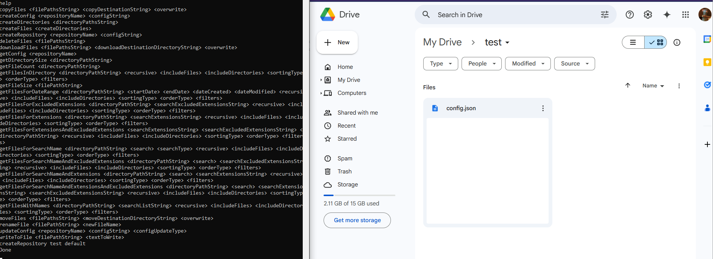

# directory-handler

A java project that has a microservice (dependency injection) structure allowing the user to choose between the local implementation or the google drive implementation. It lets the user manage (create, update, delete, copy, move, rename) files and directories in the users "repositories" which they can choose at runtime, depending on the implementation the chose (local, or google drive).

